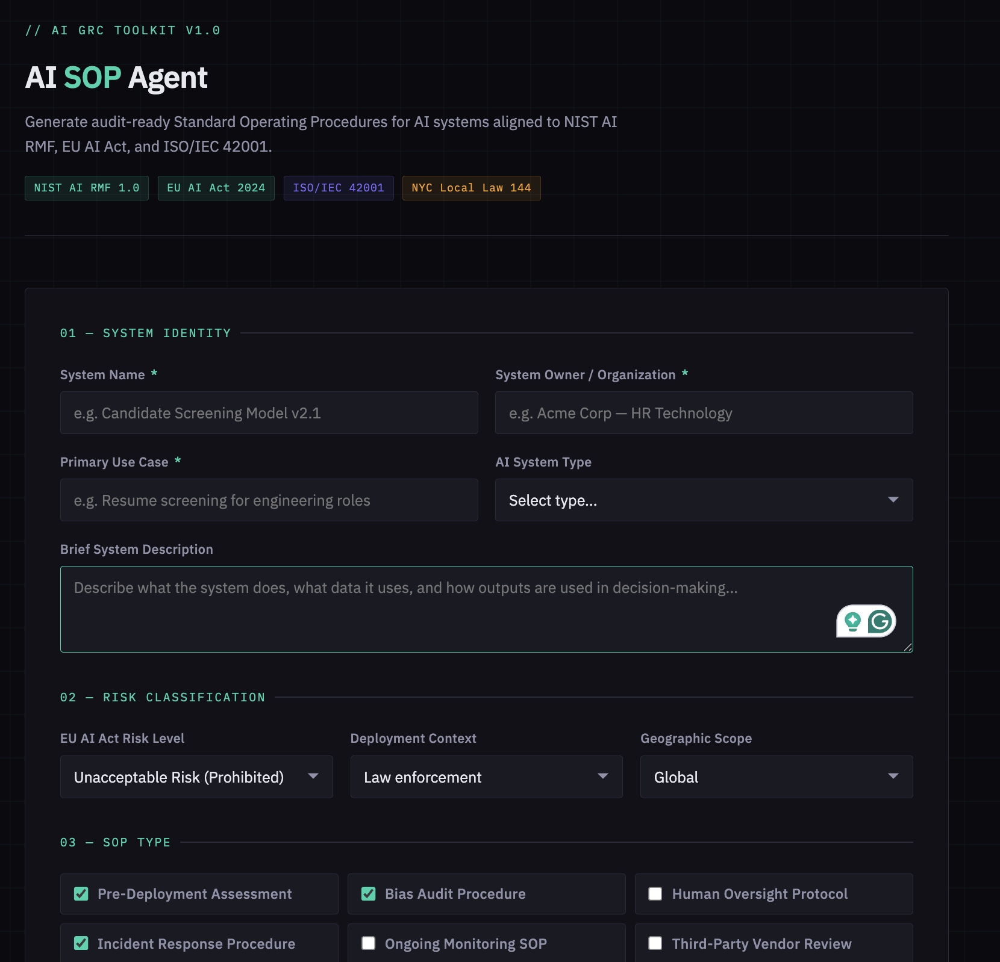

# AI SOP Agent
**Claude-Powered Audit-Ready SOP Generator for AI Systems**

[](https://airc.nist.gov/Home)
[](https://artificialintelligenceact.eu/)
[](https://www.iso.org/standard/81230.html)
[](https://www.nyc.gov/site/dca/about/automated-employment-decision-tools.page)

---

## Overview

AI SOP Agent is a Claude-powered web tool that generates complete, audit-ready Standard Operating Procedure documents for AI systems in seconds. Input your system details, select compliance frameworks, and receive a professionally formatted SOP with numbered procedure steps, RACI matrices, evidence requirements, and regulatory citations — ready to hand directly to a compliance team or auditor.

Built by an AI GRC practitioner with a provisional patent in adversarial machine learning. Every generated SOP reflects real governance methodology, not generic templates.

---

## Demo



**[Live Demo →](https://your-demo-url-here)**

---

## What It Generates

For any AI system you can generate:

| SOP Type | Description |
|----------|-------------|
| Pre-Deployment Assessment | Full risk evaluation checklist before system goes live |
| Bias Audit Procedure | Step-by-step bias testing with regulatory thresholds |
| Human Oversight Protocol | Oversight mechanisms and override procedures |
| Incident Response Procedure | AI-specific incident detection and response |
| Ongoing Monitoring SOP | Continuous monitoring cadence and escalation triggers |
| Third-Party Vendor Review | Vendor AI governance assessment procedure |
| Data Governance Procedure | Training data management and individual rights |
| Decommission / Retirement SOP | Safe system retirement and data disposal |

---

## Compliance Frameworks Supported

- **NIST AI RMF 1.0** — GOVERN, MAP, MEASURE, MANAGE functions with specific subcategory citations
- **EU AI Act** — Articles 9, 10, 12, 13, 14, 15 with enforcement context
- **ISO/IEC 42001** — AI management system requirements
- **NYC Local Law 144** — Bias audit requirements for employment AI
- **NIST SP 800-53** — Security control mapping
- **GDPR** — Data protection requirements for AI systems
- **CCPA / CPRA** — California privacy requirements
- **Colorado AI Act** — Consequential decision requirements

---

## How It Works

1. **Describe your AI system** — name, owner, use case, system type
2. **Classify the risk** — EU AI Act risk level, deployment context, geographic scope
3. **Select SOP types** — choose one or multiple procedure types
4. **Select frameworks** — choose applicable compliance frameworks
5. **Add context** — known risks or specific requirements
6. **Generate** — Claude streams a complete audit-ready SOP in real time
7. **Download** — export as markdown file named for your system

---

## Generated SOP Structure

Every generated SOP includes:

```
├── Document Header (metadata, version, owner, regulatory reference)
├── Purpose and Scope
├── Definitions
├── Roles and Responsibilities (RACI matrix)
├── Step-by-Step Procedures
│   ├── Numbered action steps with named actors
│   ├── Decision points and escalation criteria
│   ├── Required evidence for each step
│   └── Storage locations and naming conventions
├── Compliance Mapping Table
│   └── Specific article/function citations per procedure
├── Acceptance Criteria and Success Metrics
├── Review and Update Schedule
├── Sign-Off Section
└── Appendices with Checklists
```

---

## Usage

### Option 1 — Open Directly in Browser

Download `ai-sop-agent.html` and open in any modern browser. No installation required.

### Option 2 — Host on GitHub Pages

1. Fork this repository
2. Go to Settings → Pages
3. Set source to main branch
4. Access at `https://yourusername.github.io/AI-SOP-Agent`

### Option 3 — Host on AWS S3

```bash
aws s3 cp ai-sop-agent.html s3://your-bucket-name/
aws s3 website s3://your-bucket-name/ --index-document ai-sop-agent.html
```

---

## Example Output

**Input:** Resume screening AI system, high-risk EU AI Act classification, employment context, bias audit + human oversight SOPs, NIST AI RMF + EU AI Act + NYC LL144 frameworks

**Output excerpt:**
```
PROCEDURE: Bias Audit — Resume Screening AI System
ID: AI-PROC-BIAS-001
Version: 1.0
Owner: AI Risk Officer
Frequency: Quarterly and prior to any model update
Regulatory Reference: NIST AI RMF MEASURE 2.5 | EU AI Act Article 15 | NYC Local Law 144

PURPOSE
This procedure establishes the process for conducting bias audits of the 
Resume Screening AI System to ensure demographic fairness in automated 
candidate evaluation in compliance with NIST AI RMF, EU AI Act Article 15, 
and NYC Local Law 144 annual bias audit requirements.

PROCEDURE STEPS

Step 1: The AI Risk Analyst retrieves the current model version identifier 
from the model registry and records it in the bias assessment log...

[Full SOP continues with RACI matrix, evidence requirements, 
compliance mapping, escalation triggers, and sign-off section]
```

---

## Technical Details

- **Frontend:** Vanilla HTML/CSS/JavaScript — no framework dependencies
- **AI Backend:** Anthropic Claude Sonnet 4 via API
- **Streaming:** Real-time token streaming for immediate output
- **Export:** Client-side markdown download with auto-generated filename
- **Dependencies:** None — single file, runs anywhere

---

## Related Projects

- **[AI-Bias-Assessment-NIST-RMF](https://github.com/kantorkid/AI-Bias-Assessment-NIST-RMF)** — Practical AI bias assessment using NIST AI RMF with adversarial ML testing, LIME explainability, and fairness mitigation

---

## About

Built by **Jake Kantor** — AI Security and Governance practitioner, provisional patent holder in adversarial machine learning, M.S. Cybersecurity candidate (AI Security concentration) at Old Dominion University.

This tool reflects real AI GRC methodology developed through original adversarial ML research, graduate coursework in trustworthy AI, and practical application of NIST AI RMF to facial recognition bias assessment.

**Available for AI GRC consulting engagements.**

📧 jake.t.kantor@gmail.com  
🔗 [linkedin.com/in/jakekantor](https://linkedin.com/in/jakekantor)  
🔬 USPTO Provisional Patent — Adversarial ML Protection System (2026)

---

## License

MIT License — free to use, modify, and distribute with attribution.

---

*Aligned to NIST AI RMF 1.0 | EU AI Act 2024 | ISO/IEC 42001 | NYC Local Law 144*
